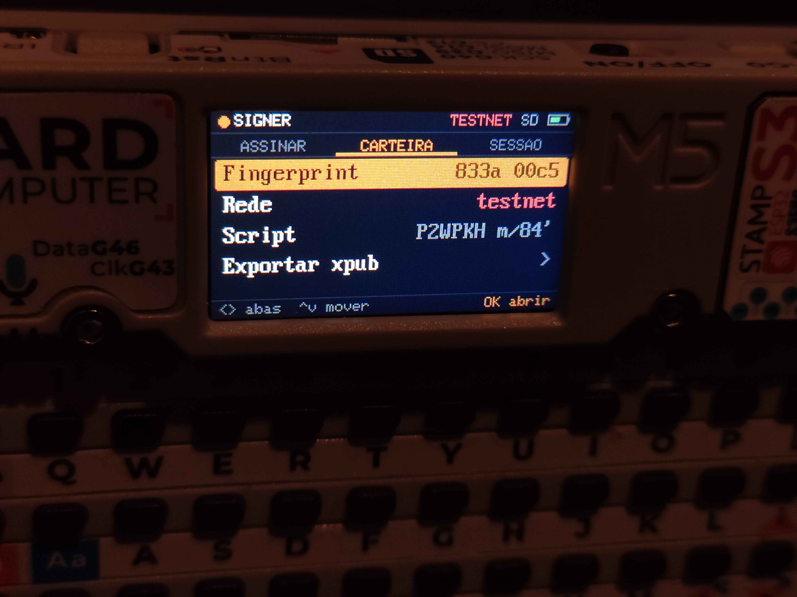

# BTCSigner Cardputer

<p align="center">
  <strong>Um signer Bitcoin air-gapped e stateless para o M5Stack Cardputer: a seed entra pelo teclado, a transação entra e sai pelo microSD, e nada secreto fica gravado.</strong>
</p>

<p align="center">
  <a href="./LICENSE"></a>
  
  
  
  
  <a href="#apoie-o-projeto"></a>
</p>

<p align="center">
  <a href="#o-que-é">O que é</a> ·
  <a href="#como-funciona">Como funciona</a> ·
  <a href="#fluxo-de-uso">Fluxo de uso</a> ·
  <a href="#segurança-em-resumo">Segurança em resumo</a> ·
  <a href="#aviso">Aviso</a> ·
  <a href="#instalando">Instalando</a> ·
  <a href="#licença">Licença</a> ·
  <a href="#apoie-o-projeto">Apoie o projeto</a>
</p>

<p align="center">
  
</p>

---

## O que é

Um firmware que transforma o M5Stack Cardputer (um mini computador com teclado, tela e slot de
microSD) numa carteira de assinatura Bitcoin **sem nenhum rádio ligado**: sem WiFi, sem Bluetooth,
sem cabo de dados. A carteira de verdade (saldo, histórico, montagem da transação) continua no
computador, em modo *watch-only* (Sparrow, Bitcoin Core, Electrum). O Cardputer só faz uma coisa:
**conferir e assinar**.

A seed nunca é gerada nem gravada no aparelho. Ela é digitada a cada sessão, vive só na RAM, e é
apagada ao encerrar a sessão ou depois de alguns minutos sem uso. Desligou, esqueceu.

O escopo é estreito de propósito: carteira single-sig BIP84 (endereços `bc1q…`, native SegWit),
PSBT v0, `SIGHASH_ALL`. Menos coisa suportada é menos coisa para dar errado.

---

## Como funciona

```
   Computador/Celular (online watch-only)            Cardputer (offline)
 ┌───────────────────────────────┐              ┌───────────────────────────┐
 │ 1. importa o zpub/descriptor  │◀─ microSD ──│ exporta zpub + descriptors│
 │ 2. monta a transação (PSBT)   │── microSD ─▶│ 3. confere e assina       │
 │ 4. finaliza e transmite       │◀─ microSD ──│    grava *_signed.psbt    │
 └───────────────────────────────┘              └───────────────────────────┘
```

O único canal entre os dois lados é o cartão microSD. O computador nunca vê a chave privada; o
Cardputer nunca vê a internet.

Antes de assinar, o firmware mostra na tela **cada saída da transação com o endereço completo** e o
valor, depois o resumo de taxa, e só assina se você **segurar Enter** por 1,5 s. Qualquer coisa que
ele não consiga verificar por inteiro (um input que não é desta seed, um troco que não bate com a
derivação, um script que não sabe exibir) faz a PSBT ser rejeitada ou sinalizada, nunca aceita em
silêncio.

<!-- IMAGEM: tela de revisão de saída / resumo de taxa. Descomente após o upload.
<p align="center">
  
</p>
-->

---

## Fluxo de uso

1. **Gere a seed fora do aparelho**, num computador offline (ex: o HTML standalone do
   [Ian Coleman BIP39 Tool](https://github.com/iancoleman/bip39/releases) num live USB sem rede,
   de preferência com entropia de dados físicos). Anote as palavras à mão e o master fingerprint.
2. **Ligue o Cardputer e digite as 12 ou 24 palavras**, com autocomplete da wordlist BIP39 e
   checagem do checksum. Passphrase (25ª palavra) opcional.
3. **Confira o fingerprint e o endereço #0** exibidos com o que você anotou — se não baterem, a seed
   ou a passphrase está errada.
4. **Exporte o zpub** para o microSD (`wallet_export.txt`, com os output descriptors) e importe no
   seu software de carteira como *watch-only*.
5. **Para gastar**: crie a PSBT no computador/celular, salve em `/psbt/` no microSD, escolha o arquivo no
   Cardputer, revise saída por saída e segure Enter para assinar.
6. **Leve o `*_signed.psbt` de volta** para o computador/celular, finalize e transmita.

<p align="center">
  
</p>

---

## Segurança em resumo

- **Sem rádio**: WiFi e Bluetooth nunca são inicializados, e isso foi conferido no binário final,
  não só no código-fonte.
- **Stateless**: nenhuma seed, chave ou passphrase é gravada em flash ou no cartão. Sessão expira
  por inatividade.
- **Criptografia auditada, não caseira**: toda a parte de curva elíptica, hash e derivação vem do
  `trezor-crypto`, a mesma biblioteca das carteiras Trezor.
- **Fail-closed**: o que não pode ser verificado não é assinado.
- **Limitações aceitas**: não há secure element (sem proteção contra ataques físicos avançados com
  o aparelho ligado e a seed carregada), não há câmera/QR, e a segurança da seed depende de como
  ela foi gerada fora do aparelho.

Os detalhes técnicos (validações do parser de PSBT, modelo de ameaça, vendoring, build, testes)
estão em **[`firmware/README.md`](./firmware/README.md)**.

---

## Aviso

**Projeto experimental.** O núcleo criptográfico e o parser de PSBT são testados contra vetores
oficiais e entradas maliciosas, e o fluxo completo já foi validado num Cardputer real em testnet,
mas o firmware **ainda não foi usado em mainnet**. Não use com fundos que você não pode perder.
Teste primeiro em testnet/signet.

---

## Instalando

Resumo: instalar o PlatformIO, buildar com `pio run -e cardputer`, gerar o `merged.bin` e instalar
pelo M5Launcher. O passo a passo completo está em
**[`firmware/README.md`](./firmware/README.md#build)**.

---

## Licença

[MIT](./LICENSE) © 2026 AlldDev

O `trezor-crypto` vendorizado em `firmware/lib/trezor-firmware/` mantém a licença própria do
upstream.

---

## Apoie o projeto

<p align="center">
  <a href="bitcoin:bc1qtu6nvfjdcujpweazeq8w0et0vs7swmef75nurw">
    
  </a>
</p>

<p align="center">
  Gostou do projeto? Uma doação em Bitcoin, de qualquer valor, ajuda a manter o desenvolvimento.
</p>

<p align="center"><code>bc1qtu6nvfjdcujpweazeq8w0et0vs7swmef75nurw</code></p>
