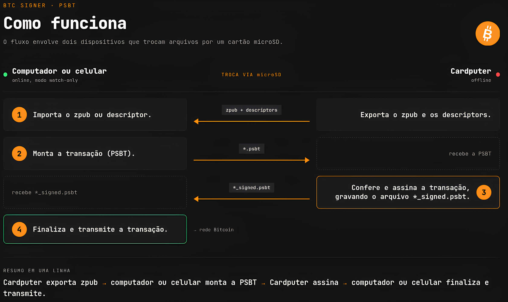
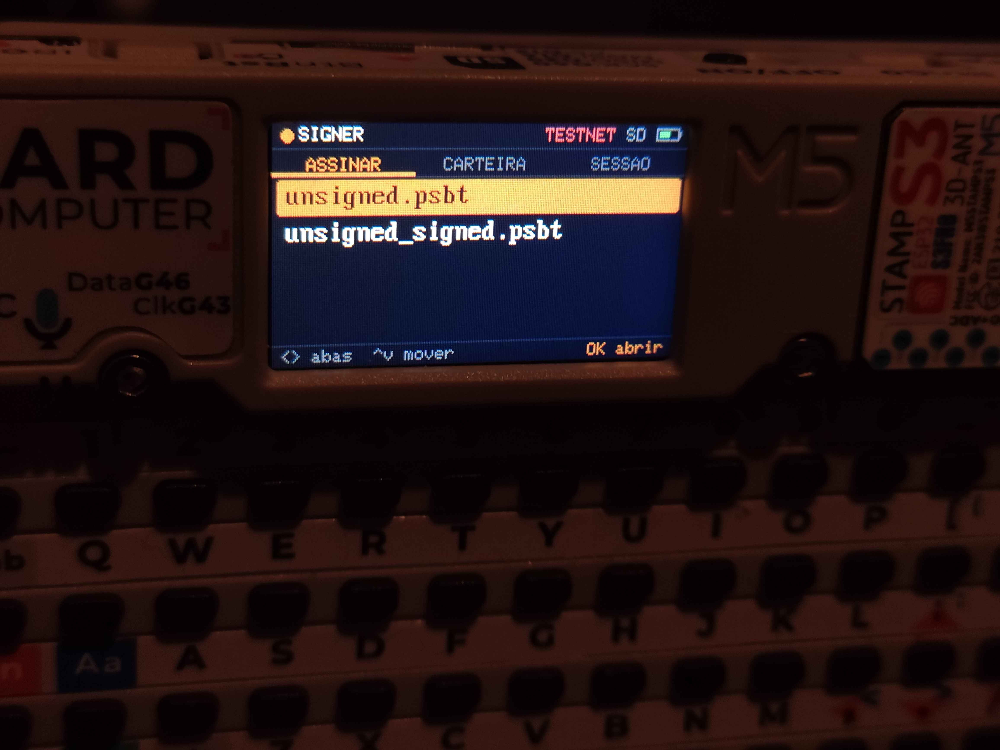

# BTCSigner Cardputer

  <strong>Um signer Bitcoin air-gapped e stateless para o M5Stack Cardputer: a seed entra pelo teclado, a transação entra e sai pelo microSD, e nada secreto fica gravado.</strong>

  
  
  
  
  
  

  <a href="#o-que-é">O que é</a> ·
  <a href="#como-funciona">Como funciona</a> ·
  <a href="#o-que-você-precisa">O que você precisa</a> ·
  <a href="#fluxo-de-uso">Fluxo de uso</a> ·
  <a href="#teclado">Teclado</a> ·
  <a href="#segurança-em-resumo">Segurança em resumo</a> ·
  <a href="#testando-em-testnet">Testando em testnet</a> ·
  <a href="#aviso">Aviso</a> ·
  <a href="#instalando">Instalando</a> ·
  <a href="#licença">Licença</a> ·
  <a href="#apoie-o-projeto">Apoie o projeto</a>

  

---

## O que é

Um firmware que transforma o M5Stack Cardputer (um mini computador com teclado, tela e slot de
microSD) numa carteira de assinatura Bitcoin **sem nenhum rádio ligado**: sem WiFi, sem Bluetooth,
sem cabo de dados. A carteira de verdade (saldo, histórico, montagem da transação) continua no
computador, em modo *watch-only* (Sparrow, Bitcoin Core, Electrum). O Cardputer só faz uma coisa:
**conferir e assinar**.

A seed nunca é gerada nem gravada no aparelho. Ela é digitada a cada sessão, vive só na RAM, e é
apagada ao encerrar a sessão ou depois de 3 minutos sem uso. Desligou, esqueceu.

O escopo é estreito de propósito: carteira single-sig BIP84 (endereços `bc1q…`, native SegWit),
PSBT v0, `SIGHASH_ALL`. Menos coisa suportada é menos coisa para dar errado. Somente SegWit nativo
(BIP84) por enquanto; Taproot (BIP86) está planejado.

---

## Como funciona

  

O único canal entre os dois lados é o cartão microSD. O computador nunca vê a chave privada; o
Cardputer nunca vê a internet.

Antes de assinar, o firmware mostra na tela **cada saída da transação com o endereço completo** e o
valor, depois o resumo (taxa e total que sai da carteira), RBF/locktime quando a transação tiver, e só assina se você **segurar Enter** por 1,5 s. Qualquer coisa que
ele não consiga verificar por inteiro (um input que não é desta seed, um troco que não bate com a
derivação, um script que não sabe exibir) faz a PSBT ser rejeitada ou sinalizada, nunca aceita em
silêncio.

O que a revisão mostra em cada saída e no resumo:

- **`DESTINO EXTERNO`**: endereço que não é desta seed. É o que entra no "Total enviado".
- **`TROCO #i verif.`**: troco desta seed (`m/84'/c'/0'/1/i`), conferido derivando a chave de novo.
- **`PROPRIO receb. #i`**: endereço de *recebimento* desta seed (`/0/i`). O dinheiro continua seu,
  mas não é o troco que a carteira costuma usar.
- **`ALEGA TROCO: NAO BATE!`**: a PSBT diz que a saída é sua, mas a derivação não confere. Trate
  como destino externo e desconfie de quem montou a transação.
- **`ALTO!`** junto do troco: índice acima de 1000, fora do que uma watch-only costuma escanear.
- **Taxa alta**: aviso em vermelho se a taxa passar de 5% do valor enviado ou de 0,001 BTC.
- **DETALHES**: tela extra que só aparece se a transação sinaliza RBF (pode ser substituída) ou tem
  locktime (só pode ser minerada a partir de um bloco/horário).

---

## O que você precisa

- **M5Stack Cardputer** (ou Cardputer-ADV).
- **Cartão microSD**, para levar e trazer as PSBTs e o `wallet_export.txt`.
- **Software de carteira watch-only com suporte a PSBT** no computador: Sparrow, Bitcoin Core ou
  Electrum.
- **Opcional:** M5Stack **Unit RFID2** no conector Grove + cartão **MIFARE Classic 1K**, para o
  backup cifrado da seed.

---

## Fluxo de uso

1. **Gere a seed fora do aparelho**, num computador offline (ex: o HTML standalone do
   [Ian Coleman BIP39 Tool](https://github.com/iancoleman/bip39/releases) num live USB sem rede,
   de preferência com entropia de dados físicos). Anote as palavras à mão e, na aba BIP84, o
   primeiro endereço de *Derived Addresses* (o #0). O Ian Coleman não mostra o master fingerprint,
   então o endereço #0 é a referência para conferir no passo 3.
2. **Ligue o Cardputer, escolha a rede e o tipo de carteira** (SegWit nativo; Taproot aparece como
   "em breve") e **digite as 12 ou 24 palavras**, com autocomplete da wordlist BIP39 e checagem do
   checksum. Passphrase (25ª palavra) opcional. Quem tem backup no cartão RFID escolhe
   **Restaurar do cartão**: aproxima o cartão, digita a senha dele e depois a passphrase.
3. **Confira o endereço #0** (e o fingerprint, se você o tiver de outra fonte) com o que você
   anotou. Se não baterem, a seed ou a passphrase está errada. Logo depois, o aparelho oferece
   gravar o backup cifrado no cartão RFID (opcional; ESC pula; não aparece quando a seed veio do
   cartão).
4. **Exporte o zpub** para o microSD (CARTEIRA > Exportar xpub > Baixar arquivo grava o
   `wallet_export.txt`, com os output descriptors) e importe no seu software de carteira como
   *watch-only*.
5. **Para receber**: antes de passar um endereço adiante, confira em CARTEIRA > Endereço de
   recebimento (índices 0 a 999) que o Cardputer mostra o mesmo endereço que a watch-only. O
   aparelho calcula o endereço pela chave privada e de novo pelo zpub exportado, e só o mostra se
   os dois baterem.
6. **Para gastar**: crie a PSBT no computador/celular, salve em `/psbt/` no microSD (ou na raiz, se
   a pasta não existir), escolha o arquivo na aba ASSINAR, revise saída por saída e segure Enter
   para assinar.
7. **Leve o `*_signed.psbt` de volta** para o computador/celular, finalize e transmita.

### Requisitos da PSBT

- **PSBT v0**, em binário ou base64. A assinada (`<nome>_signed.psbt`) sai no mesmo formato.
- **Inputs só desta seed**, SegWit nativo (P2WPKH, `m/84'`), com a derivação BIP32 preenchida.
- **Transação anterior completa** (`non_witness_utxo`) em cada input: é obrigatória, para o valor
  gasto não poder ser falsificado. Sparrow, Bitcoin Core e Electrum já incluem.
- **Limites**: até 32 KB por arquivo, 20 entradas e 20 saídas.
- Assinatura só `SIGHASH_ALL`. PSBT que já venha com assinatura é recusada.

  

---

## Teclado

O Cardputer não tem teclas Esc nem setas. O firmware usa:

| Ação | Tecla |
| --- | --- |
| Voltar / cancelar (ESC) | `` ` `` (canto superior esquerdo) |
| Digitar o caractere `` ` `` na passphrase | **Fn** + `` ` `` |
| Mover para cima / baixo | `;` / `.` |
| Mover para esquerda / direita | `,` / `/` |
| Mostrar / ocultar a passphrase ou a senha do cartão | **Tab** |
| Assinar a PSBT ou apagar o backup do cartão | **segurar Enter** (1,5 s) |

Na passphrase e nas senhas, `;` `,` `.` `/` são só caracteres comuns.

Depois de carregar a seed, o menu tem quatro áreas: **ASSINAR** (PSBTs do microSD), **CARTEIRA**
(fingerprint, rede, script, exportar xpub, endereço de recebimento), **TOOLS** (testar backup em
papel ou cartão, apagar o backup RFID, brilho) e **SESSAO** (encerrar a sessão).

---

## Segurança em resumo

- **Sem rádio**: WiFi e Bluetooth nunca são inicializados, e isso foi conferido no binário final,
  não só no código-fonte. O leitor RFID opcional só liga seu campo de curto alcance durante um
  backup ou uma restauração.
- **Stateless**: nenhuma seed, chave ou passphrase é gravada em flash ou no cartão. Sessão expira
  por inatividade.
- **Backup opcional no cartão RFID (opt-in)**: quem quiser evitar digitar as palavras toda vez pode
  gravar a seed **cifrada** (AES-256 + HMAC, chave derivada de uma senha longa por PBKDF2) num
  cartão MIFARE Classic, com a M5Stack Unit RFID2. A passphrase nunca vai para o cartão. O cartão
  deve ser tratado como público: a segurança depende só da força da senha. O cartão guarda duas
  cópias, e uma gravação interrompida não perde o backup. Na área TOOLS dá para conferir o backup
  (papel ou cartão, com a passphrase) contra a sessão aberta e apagar o backup do cartão. Nada disso acontece se você não pedir. Detalhes em [`firmware/README.md`](./firmware/README.md#backup-opcional-no-cartão-rfid).
- **Criptografia auditada, não caseira**: toda a parte de curva elíptica, hash e derivação vem do
  `trezor-crypto`, a mesma biblioteca das carteiras Trezor.
- **Fail-closed**: o que não pode ser verificado não é assinado.
- **Limitações aceitas**: não há secure element (sem proteção contra ataques físicos avançados com
  o aparelho ligado e a seed carregada), não há câmera/QR, e a segurança da seed depende de como
  ela foi gerada fora do aparelho.

O build, a instalação e o funcionamento do firmware
estão em **[`firmware/README.md`](./firmware/README.md)**.

---

## Testando em testnet

Na tela REDE, **Testnet/Signet** serve para testnet3, testnet4 e signet: todas usam endereços
`tb1…` e o caminho `m/84'/1'/0'`. Comece sempre por aí.

`others/seed-test.html` é um laboratório de testes para **testnet4**. No navegador, ele gera ou
importa uma seed, mostra o fingerprint e os endereços para conferir no Cardputer, consulta o saldo,
monta a PSBT para assinar e transmite a assinada pelo `mempool.space`.

> **Só para testnet.** A página roda online, carrega bibliotecas do `esm.sh` e a seed fica no
> navegador. **Nunca use nela uma seed com fundos reais.**

---

## Aviso

**Projeto experimental.** O núcleo criptográfico e o parser de PSBT são testados contra vetores
oficiais e entradas maliciosas, e o fluxo completo já foi validado num Cardputer real em testnet,
mas o firmware **ainda não foi usado em mainnet**. Não use com fundos que você não pode perder.
Teste primeiro em testnet/signet.

---

## Instalando

Resumo: instalar o PlatformIO, buildar com `pio run -e cardputer`, gerar o `merged.bin` e instalar
pelo M5Launcher. O passo a passo completo está em
**[`firmware/README.md`](./firmware/README.md#build)**.

---

## Licença

[MIT](./LICENSE) © 2026 AlldDev

O `trezor-crypto` vendorizado em `firmware/lib/trezor-firmware/` mantém a licença própria do
upstream.

---

## Apoie o projeto

  

  Gostou do projeto? Uma doação em Bitcoin, de qualquer valor, ajuda a manter o desenvolvimento.

<code>bc1qtu6nvfjdcujpweazeq8w0et0vs7swmef75nurw</code>

